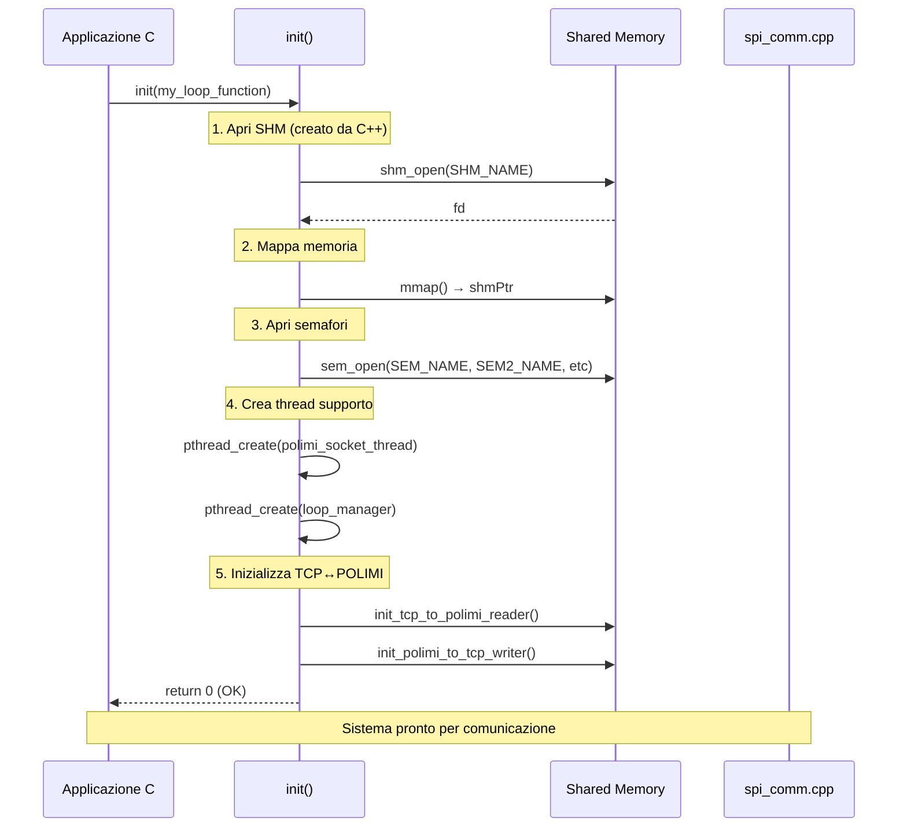
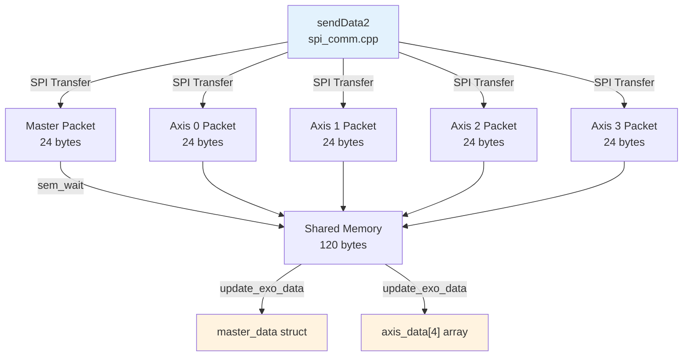
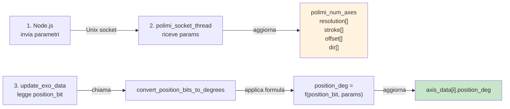
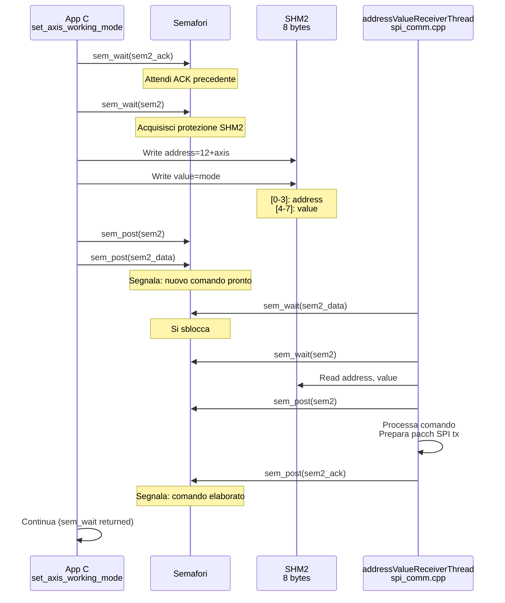

# PARTE 2: API REFERENCE DETTAGLIATA

## 📖API REFERENCE - FUNZIONI PRINCIPALI

### 1. INIZIALIZZAZIONE SISTEMA

#### `int init(callback_t loop_callback)`

**Scopo:** Inizializza tutti i semafori, la memoria condivisa e avvia i thread di supporto.

**Parametri:**

<table><thead><tr><th width="131.22222900390625">Parametro</th><th width="109.111083984375">Tipo</th><th>Descrizione</th></tr></thead><tbody><tr><td>loop_callback</td><td>callback_t</td><td>Funzione callback da eseguire a ogni ciclo SPI (sincronizzato con C++)</td></tr></tbody></table>

**Valori di ritorno:**

<table><thead><tr><th width="96.22222900390625">Valore</th><th>Significato</th></tr></thead><tbody><tr><td><code>0</code></td><td>✅ Inizializzazione riuscita</td></tr><tr><td><code>1</code></td><td>❌ Errore: fallita l'apertura di SHM o semafori</td></tr></tbody></table>

Cosa fa:



**Memoria allocata e semafori inizializzati:**

<table><thead><tr><th width="123.4444580078125">Risorsa</th><th width="227.22216796875">Nome</th><th width="134.666748046875">Creato da</th><th width="116.888916015625">Aperto da</th><th width="141.333251953125">Scopo</th></tr></thead><tbody><tr><td>SHM</td><td>/spi_shared_memory</td><td>spi_comm.cpp</td><td>utils.c</td><td>Dati SPI</td></tr><tr><td>SEM</td><td>/spi_shared_semaphore</td><td>spi_comm.cpp</td><td>utils.c</td><td>Protezione SHM</td></tr><tr><td>SEM_LOOP_SYNC</td><td>/spi_loop_sync_semaphore</td><td>spi_comm.cpp</td><td>utils.c</td><td>Sincronizzazione loop</td></tr><tr><td>SHM2</td><td>/spi_shared_memory2</td><td>spi_comm.cpp</td><td>utils.c</td><td>Comandi assi</td></tr><tr><td>SEM2_DATA</td><td>/spi_shared_semaphore2_data</td><td>spi_comm.cpp</td><td>utils.c</td><td>Handshake dati</td></tr><tr><td>SEM2_ACK</td><td>/spi_shared_semaphore2_ack</td><td>spi_comm.cpp</td><td>utils.c</td><td>Handshake ack</td></tr><tr><td>SHM3</td><td>/spi_shared_memory3</td><td>spi_comm.cpp</td><td>utils.c</td><td>Target assi</td></tr></tbody></table>

**Thread avviati da init():**

1. **polimi\_socket\_thread** - Ascolta parametri POLIMI via Unix socket
2. **polimi\_button\_socket\_thread** - Ascolta eventi pulsanti
3. **loop\_manager** - Sincronizza il loop C con i dati SPI C++

**Esempio di utilizzo reale:**

```c
#include "utils.h"

// Callback che verrà eseguito ad ogni ciclo SPI (~1kHz)
void my_game_loop(void)
{
    // Legge i dati dell'esoscheletro
    if (update_exo_data() == 0)
    {
        // Converti posizioni bit → gradi
        convert_position_bits_to_degrees();
        
        // Leggi dati
        printf("Master: x=%.2f y=%.2f z=%.2f\n", 
               master_data.x, master_data.y, master_data.z);
        printf("Axis 0: pos=%.2f deg\n", axis_data[0].position_deg);
        
        // Invia comandi
        float target = 45.0f;
        set_target(0, TARGET_POSITION_DEG, target);
    }
}

int main(void)
{
    printf("Starting POLIMI utils initialization...\n");
    
    // Inizializza tutto il sistema
    if (init(my_game_loop) != 0)
    {
        fprintf(stderr, "Failed to initialize POLIMI utils\n");
        return 1;
    }
    
    printf("POLIMI utils initialized successfully!\n");
    printf("Loop callback running at ~1kHz (synchronized with SPI)\n");
    
    // La funzione my_game_loop() verrà richiamata automaticamente
    // dal thread loop_manager ad ogni nuovo dato SPI disponibile
    
    // Il main può continuare o fare altre cose
    while (1)
    {
        sleep(1);
        printf("Main thread is free to do other things...\n");
    }
    
    return 0;
}
```

**Errori comuni:**

| Errore                                                                                                                                                                                       | Causa                                                                                                                                                                                                       | Soluzione                             |
| -------------------------------------------------------------------------------------------------------------------------------------------------------------------------------------------- | ----------------------------------------------------------------------------------------------------------------------------------------------------------------------------------------------------------- | ------------------------------------- |
| [shm\_open failed](https://vscode-file/vscode-app/c:/Users/User/AppData/Local/Programs/Microsoft%20VS%20Code/c3a26841a8/resources/app/out/vs/code/electron-browser/workbench/workbench.html) | [spi\_comm.cpp](https://vscode-file/vscode-app/c:/Users/User/AppData/Local/Programs/Microsoft%20VS%20Code/c3a26841a8/resources/app/out/vs/code/electron-browser/workbench/workbench.html) non in esecuzione | Avvia `spi_comm` prima                |
| [sem\_open failed](https://vscode-file/vscode-app/c:/Users/User/AppData/Local/Programs/Microsoft%20VS%20Code/c3a26841a8/resources/app/out/vs/code/electron-browser/workbench/workbench.html) | Semafori non creati                                                                                                                                                                                         | Attendi che spi\_comm crei i semafori |
| `TCP_POLIMI init failed`                                                                                                                                                                     | TCP server non in esecuzione                                                                                                                                                                                | Avvia TCP server via Node.js          |

### 2. LETTURA DATI ESOSCHELETRO

#### `int update_exo_data(void)`

**Scopo:** Legge l'ultimo pacchetto SPI da memoria condivisa e aggiorna le strutture [master\_data](https://vscode-file/vscode-app/c:/Users/User/AppData/Local/Programs/Microsoft%20VS%20Code/c3a26841a8/resources/app/out/vs/code/electron-browser/workbench/workbench.html) e [axis\_data\[4\]](https://vscode-file/vscode-app/c:/Users/User/AppData/Local/Programs/Microsoft%20VS%20Code/c3a26841a8/resources/app/out/vs/code/electron-browser/workbench/workbench.html).

**Valori di ritorno:**

<table><thead><tr><th width="97.33331298828125">Valore</th><th>Significato</th></tr></thead><tbody><tr><td><code>0</code></td><td>✅ Dati letti correttamente, strutture aggiornate</td></tr><tr><td><code>1</code></td><td>❌ Errore: header pacchetto non valido</td></tr></tbody></table>

**Strutture aggiornate:**

```c
// Dati master (coordinate xyz, stato, errori)
master_data_t master_data = {
    .error,                    // 1 = errore
    .warning,                  // 1 = warning
    .on_target_position,       // 1 = raggiunto target
    .motion_ongoing,           // 1 = movimento in corso
    .master_state,             // enum: STARTUP, WAITING, AUTO, ERROR...
    .master_working_mode,      // enum: OFF, STAND_STILL, POSITION_TARGET...
    .warning_code,             // codice errore (uint16_t)
    .x, .y, .z                // coordinate sistema (float)
};

// Dati 4 assi (posizione, velocità, torque, stato)
axis_data_t axis_data[4] = {
    .error,                    // 1 = errore
    .warning,                  // 1 = warning
    .on_target_position,       // 1 = raggiunto target
    .motion_ongoing,           // 1 = movimento in corso
    .driver_state,             // enum: NOT_CONNECTED, SETUP_NEEDED, DRIVER_WAITING...
    .working_mode,             // enum: DRIVER_OFF, POS_INT_PROFILER, SPEED_PERCENT...
    .warning_code,             // codice errore (uint16_t)
    .position_bit,             // encoder counts (int16_t raw)
    .position_deg,             // converted degrees (float) - vedi convert_position_bits_to_degrees()
    .speed,                    // velocità (float)
    .torque                    // coppia motore (int16_t)
};
```

**Layout del pacchetto SPI ricevuto (da spi\_comm.cpp):**



**⚠️ Dettagli importanti:**

1. **Sincronizzazione:** La funzione utilizza [sem\_wait()](https://vscode-file/vscode-app/c:/Users/User/AppData/Local/Programs/Microsoft%20VS%20Code/c3a26841a8/resources/app/out/vs/code/electron-browser/workbench/workbench.html) per proteggere l'accesso a SHM
2. **Conversione posizione:** I valori raw vengono letti in `position_bit`, poi convertiti a gradi da [convert\_position\_bits\_to\_degrees()](https://vscode-file/vscode-app/c:/Users/User/AppData/Local/Programs/Microsoft%20VS%20Code/c3a26841a8/resources/app/out/vs/code/electron-browser/workbench/workbench.html)
3. **Float in SPI:** I dati Speed (4 bytes) sono già in formato float nel pacchetto SPI
4. **Validazione header:** Se gli header non corrispondono (master: 0xF0/0x0F, axis: 0xFF/0xFF), la funzione ritorna 1

#### `void convert_position_bits_to_degrees(void)`

**Scopo:** Converte `position_bit` (encoder counts) → `position_deg` (gradi) usando i parametri POLIMI.

Dove:

* `direction` ∈ {-1, +1} - Direzione rotazione asse
* `stroke` - Corsa massima utile (gradi)
* `resolution` - Conteggi encoder per rotazione completa
* `offset` - Offset zero encoder

**Parametri POLIMI (ricevuti via Unix socket):**

<table><thead><tr><th width="183.44439697265625">Variabile</th><th width="122">Tipo</th><th>Descrizione</th></tr></thead><tbody><tr><td>polimi_num_axes</td><td>int</td><td>Numero di assi configurati (0-8)</td></tr><tr><td>polimi_resolution[i]</td><td>int32_t</td><td>Encoder counts per asse i</td></tr><tr><td>polimi_stroke[i]</td><td>int32_t</td><td>Corsa utile per asse i</td></tr><tr><td>polimi_offset[i]</td><td>int32_t</td><td>Offset encoder per asse i</td></tr><tr><td>polimi_dir[i]</td><td>int32_t</td><td>Direzione (±1) per asse i</td></tr></tbody></table>

**Flusso temporale:**



Esempio:

```c
// Parametri ricevuti da Node.js (salvati in globali):
// polimi_num_axes = 2
// polimi_resolution[0] = 4096  (encoder 12-bit)
// polimi_stroke[0] = 180       (corsa 180°)
// polimi_offset[0] = 0         (nessun offset)
// polimi_dir[0] = 1            (direzione +)

// Flag SPI ricevuto:
// axis_data[0].position_bit = 2048

// Conversione:
// deg = ((10 × 1 × 180) / 4096) × (2048 - 0)
// deg = (1800 / 4096) × 2048
// deg = 0.439 × 2048
// deg = 900.0 (ma limitato dalla corsa reale, vedi stroke)

// Risultato:
// axis_data[0].position_deg = 90.0 (metà corsa)
```

### 3. COMANDI AGLI ASSI

#### `int set_axis_working_mode(int axis, driver_working_mode_enum mode)`

**Scopo:** Invia un comando per settare la modalità operativa di un asse (es. POSITION\_TARGET, SPEED\_PERCENT).

**Parametri:**

<table><thead><tr><th width="128.11114501953125">Parametro</th><th>Tipo</th><th width="117.1112060546875">Range</th><th>Descrizione</th></tr></thead><tbody><tr><td>axis</td><td>int</td><td>0-3</td><td>Indice asse (0-3)</td></tr><tr><td>mode</td><td>driver_working_mode_enum</td><td>0-9</td><td>Modalità desiderata</td></tr></tbody></table>

**Valori di ritorno:**

<table><thead><tr><th width="105.11114501953125">Valore</th><th>Significato</th></tr></thead><tbody><tr><td><code>0</code></td><td>✅ Comando inviato correttamente</td></tr><tr><td><code>1</code></td><td>❌ Errore: parametri invalidi o SHM non inizializzata</td></tr></tbody></table>

**Enumerazione driver\_working\_mode\_enum:**

<table><thead><tr><th width="99">Valore</th><th width="258.4444580078125">Nome</th><th>Descrizione</th></tr></thead><tbody><tr><td>0</td><td>DRIVER_OFF</td><td>Driver spento</td></tr><tr><td>1</td><td>POS_INT_PROFILER</td><td>Controlld posizione con profiler velocità</td></tr><tr><td>2</td><td>SPEED_PERCENT</td><td>Velocità in percentuale (±100%)</td></tr><tr><td>3</td><td>SPEED_ABS</td><td>Velocità assoluta (rpm/rad·s)</td></tr><tr><td>4</td><td>SOFT_STOP</td><td>Stop decelerato</td></tr><tr><td>5</td><td>HARD_STOP</td><td>Stop d'emergenza</td></tr><tr><td>6</td><td>STAND_STILL</td><td>Fermo mantenendo posizione</td></tr><tr><td>7</td><td>STAND_STILL_WAITING</td><td>(uso interno)</td></tr><tr><td>8</td><td>STAND_STILL_AUTO</td><td>(uso interno)</td></tr><tr><td>9</td><td>COMPLAINT_TRANSPARENT</td><td>Modalità hands-on</td></tr></tbody></table>



***

#### `int set_master_working_mode(master_working_mode_enum mode)`

**Scopo:** Invia un comando per settare la modalità operativa del MASTER.

**Valori di ritorno:**

<table><thead><tr><th width="94">Valore</th><th>Significato</th></tr></thead><tbody><tr><td><code>0</code></td><td>✅ Comando inviato</td></tr><tr><td><code>1</code></td><td>❌ Errore</td></tr></tbody></table>

**Enumerazione `master_working_mode_enum`:**

<table><thead><tr><th width="90.11114501953125">Valore</th><th width="231.333251953125">Nome</th><th>Descrizione</th></tr></thead><tbody><tr><td>0</td><td>OFF</td><td>Sistema spento</td></tr><tr><td>1</td><td>STAND_STILL</td><td>Fermo mantenendo posizione</td></tr><tr><td>2</td><td>TEST</td><td>Modalità test (tipicamente muove assi sequenzialmente)</td></tr><tr><td>3</td><td>JOG</td><td>Movimento manuale fine</td></tr><tr><td>4</td><td>POSITION_TARGET</td><td>Raggiungimento target coordinato</td></tr><tr><td>5</td><td>POS_TARGET_WAIT_START</td><td>Target caricato, attesa comando start</td></tr><tr><td>6</td><td>STOP</td><td>Stop d'emergenza</td></tr><tr><td>7</td><td>RESET_ERROR</td><td>Reset errore precedente</td></tr><tr><td>8-9</td><td>Developer modes</td><td>Per uso sviluppatori</td></tr></tbody></table>

**Funzionamento identico a `set_axis_working_mode()`, ma:**

* Address fisso: `10` (anziché 12-15)
* Valore: indice enum master\_working\_mode\_enum

### 4. SETTING TARGET

#### `set_target2()` - Via SHM3 (Batch)

**Scopo:** Invia target per **uno o più assi simultaneamente** usando SHM3 (migliore per comandi batch).

**Parametri:**

<table><thead><tr><th width="117.88885498046875">Parametro</th><th width="175">Tipo</th><th>Descrizione</th></tr></thead><tbody><tr><td>axis</td><td>int</td><td>Indice asse (0-3)</td></tr><tr><td>type</td><td>targets_type_enum</td><td>Tipo di target</td></tr><tr><td>value</td><td>float</td><td>Valore target</td></tr></tbody></table>

**Enumerazione targets\_type\_enum:**

<table><thead><tr><th width="91.44439697265625">Valore</th><th width="226.888916015625">Nome</th><th width="146.6666259765625">Unità</th><th>Descrizione</th></tr></thead><tbody><tr><td>0</td><td>NO_TARGET</td><td>-</td><td>Nessun target</td></tr><tr><td>1</td><td>TARGET_POSITION_DEG</td><td>gradi</td><td>Posizione in gradi</td></tr><tr><td>2</td><td>TARGET_POSITION_BIT</td><td>encoder counts</td><td>Posizione in bit encoder</td></tr><tr><td>3</td><td>TARGET_SPEED</td><td>rad/s</td><td>Velocità assoluta</td></tr><tr><td>4</td><td>TARGET_SPEED_PERCENT</td><td>%</td><td>Velocità in percentuale (±100)</td></tr><tr><td>5</td><td>TARGET_TORQUE</td><td>N·m</td><td>Coppia motore</td></tr></tbody></table>

**Valori di ritorno:**

<table><thead><tr><th width="91.77783203125">Valore</th><th>Significato</th></tr></thead><tbody><tr><td><code>0</code></td><td>✅ Target inviato correttamente</td></tr><tr><td><code>1</code></td><td>❌ Errore: parametri invalidi</td></tr></tbody></table>

**Layout SHM3 (20 bytes):**

| Asse | Type Offset | Value Offset | Bytes |
| ---- | ----------- | ------------ | ----- |
| 0    | 0           | 1-4          | 5     |
| 1    | 5           | 6-9          | 5     |
| 2    | 10          | 11-14        | 5     |
| 3    | 15          | 16-19        | 5     |
