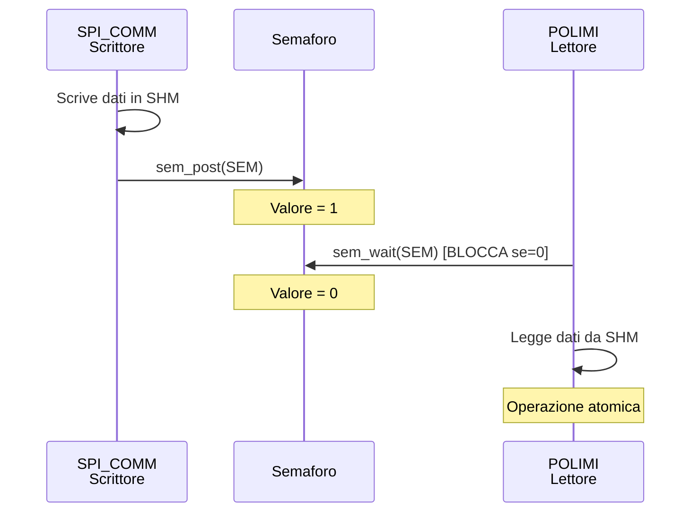
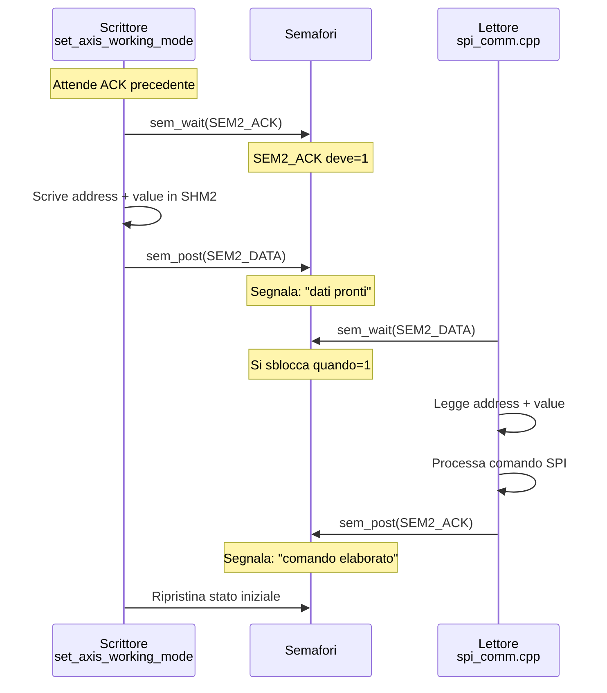

# Utils

## 📚 DOCUMENTAZIONE UTILS.C - POLIMI UTILITIES

### 1. INTRODUZIONE

Il modulo `utils.c` è il **cuore della comunicazione** del sistema POLIMI. Fornisce un set di funzioni pronte all'uso che gestiscono:

* ✅ **Lettura dati SPI** da master e assi
* ✅ **Sincronizzazione inter-processo** via memoria condivisa e semafori
* ✅ **Controllo dell'esoscheletro** (setting mode assi, posizioni target)
* ✅ **Comunicazione TCP** (ricezione comandi gioco, invio risposte)
* ✅ **Gestione pulsanti** con thread sicuro

### 2. ARCHITETTURA DELLA MEMORIA CONDIVISA

#### Panoramica delle 5 regioni SHM

<table><thead><tr><th width="43.55560302734375">#</th><th width="184.4444580078125">SHM Nome</th><th width="103.4444580078125">Dimensione</th><th>Scopo</th><th>Direzione</th><th>Semafori</th></tr></thead><tbody><tr><td>1</td><td><code>SHM</code></td><td>120 bytes</td><td>Master + 4 assi SPI packets</td><td>SPI→POLIMI</td><td>1 (<code>SEM</code>)</td></tr><tr><td>2</td><td><code>SHM2</code></td><td>8 bytes</td><td>Address + Value (commands)</td><td>App→SPI</td><td>3 (<code>SEM2</code>, <code>SEM2_DATA</code>, <code>SEM2_ACK</code>)</td></tr><tr><td>3</td><td><code>SHM3</code></td><td>20 bytes</td><td>Targets per 4 assi</td><td>App→SPI</td><td>2 (<code>SEM3</code>, <code>SEM3_DATA</code>)</td></tr><tr><td>4</td><td><code>SHM_TCP_TO_POLIMI</code></td><td>1 byte</td><td>TCP command byte</td><td>TCP→POLIMI</td><td>3 semafori handshake</td></tr><tr><td>5</td><td><code>SHM_POLIMI_TO_TCP</code></td><td>15 bytes</td><td>Game answer info struct</td><td>POLIMI→TCP</td><td>3 semafori handshake</td></tr></tbody></table>

#### Diagramma della memoria

#### Layout della memoria SHM (120 bytes)

<table><thead><tr><th width="92.5555419921875">Offset</th><th width="140.22222900390625">Contenuto</th><th width="89.22222900390625">Bytes</th><th>Descrizione</th></tr></thead><tbody><tr><td>0-23</td><td>Master Packet</td><td>24</td><td>Dati dello stato master (errori, coordinate XYZ)</td></tr><tr><td>24-47</td><td>Axis 0 Packet</td><td>24</td><td>Dati asse 0 (posizione, torque, velocità)</td></tr><tr><td>48-71</td><td>Axis 1 Packet</td><td>24</td><td>Dati asse 1</td></tr><tr><td>72-95</td><td>Axis 2 Packet</td><td>24</td><td>Dati asse 2</td></tr><tr><td>96-119</td><td>Axis 3 Packet</td><td>24</td><td>Dati asse 3</td></tr></tbody></table>

***

#### Layout della memoria SHM2 (8 bytes)

<table><thead><tr><th width="90.111083984375">Offset</th><th width="116.22222900390625">Contenuto</th><th width="91.111083984375">Bytes</th><th width="129.4444580078125">Tipo</th><th>Descrizione</th></tr></thead><tbody><tr><td>0-3</td><td>Address</td><td>4</td><td>int32_t</td><td>Indirizzo/identificatore comando</td></tr><tr><td>4-7</td><td>Value</td><td>4</td><td>int32_t o float</td><td>Valore da inviare (interpretazione dipende da address)</td></tr></tbody></table>

**Esempio di utilizzo:**

* `address = 12` → comando per axis 0
* `value = 5` → POSITION\_TARGET mode

***

#### Layout della memoria SHM3 (20 bytes)

<table><thead><tr><th width="87.888916015625">Asse</th><th width="95">Offset</th><th width="117.99993896484375">Type Byte</th><th width="133">Value Float</th><th>Dimensione</th></tr></thead><tbody><tr><td>0</td><td>0-4</td><td>0 (1B)</td><td>1-4 (4B)</td><td>5 bytes</td></tr><tr><td>1</td><td>5-9</td><td>5 (1B)</td><td>6-9 (4B)</td><td>5 bytes</td></tr><tr><td>2</td><td>10-14</td><td>10 (1B)</td><td>11-14 (4B)</td><td>5 bytes</td></tr><tr><td>3</td><td>15-19</td><td>15 (1B)</td><td>16-19 (4B)</td><td>5 bytes</td></tr></tbody></table>

**Per ogni asse:**

* **Type Byte** (1 byte): tipo di target (targets\_type\_enum)
* **Value Float** (4 bytes): valore float del target

***

#### Layout della memoria SHM\_POLIMI\_TO\_TCP (15 bytes)

<table><thead><tr><th width="126.77777099609375">Campo</th><th width="91.6666259765625">Offset</th><th width="129.3333740234375">Dimensione</th><th width="90">Tipo</th><th>Descrizione</th></tr></thead><tbody><tr><td>timestamp</td><td>0-3</td><td>4 bytes</td><td>uint32_t</td><td>Unix timestamp</td></tr><tr><td>current_rep</td><td>4-5</td><td>2 bytes</td><td>uint16_t</td><td>Ripetizione attuale</td></tr><tr><td>performance</td><td>6-9</td><td>4 bytes</td><td>float</td><td>Performance score</td></tr><tr><td>subtask</td><td>10-11</td><td>2 bytes</td><td>int16_t</td><td>ID sottotask corrente</td></tr><tr><td>tempo_attesa</td><td>12-13</td><td>2 bytes</td><td>int16_t</td><td>Tempo di attesa in ms</td></tr><tr><td>game</td><td>14</td><td>1 byte</td><td>uint8_t</td><td>ID gioco attivo</td></tr></tbody></table>

### 3. MECCANISMO DEI SEMAFORI

#### Tipo 1: Lettore singolo (SEM, SEM3)



**Vantaggi:**

* ✅ Semplice e veloce
* ✅ Perfetto per producer-consumer singolo
* ✅ Nessun overhead di acknowledge

#### Tipo 2: Handshake bilaterale (SEM2\_DATA + SEM2\_ACK)



**Vantaggi:**

* ✅ Sincronizzazione bilaterale garantita
* ✅ Nessun comando perso
* ✅ Scrittore sa quando il comando è elaborato

#### Codice reale - Inizializzazione semafori

```c
int init(callback_t loop_callback)
{
    // Semaforo SEM (creato da SPI, aperto da POLIMI)
    sem = sem_open(SEM_NAME, 0);  // 0 = non creare se non esiste
    if (sem == SEM_FAILED)
    {
        fprintf(stderr, "Errore: sem_open(%s) fallito\n", SEM_NAME);
        goto cleanup;
    }

    // Semafori handshake SEM2_DATA e SEM2_ACK
    // (creati se non esistono con valore iniziale 0)
    sem2_data = sem_open(SEM2_DATA_NAME, O_CREAT, 0666, 0);
    if (sem2_data == SEM_FAILED)
    {
        fprintf(stderr, "Errore: sem_open(%s) fallito\n", SEM2_DATA_NAME);
        goto cleanup;
    }

    sem2_ack = sem_open(SEM2_ACK_NAME, O_CREAT, 0666, 0);
    if (sem2_ack == SEM_FAILED)
    {
        fprintf(stderr, "Errore: sem_open(%s) fallito\n", SEM2_ACK_NAME);
        goto cleanup;
    }

    printf("[INIT] Semafori aperti correttamente\n");
    return 0;

cleanup:
    // Cleanup su errore...
    return -1;
}
```

### 4. VARIABILI GLOBALI PRINCIPALI

#### Accesso alla memoria SHM

<table><thead><tr><th width="143.44439697265625">Variabile</th><th width="107.5555419921875">Tipo</th><th>Scopo</th></tr></thead><tbody><tr><td>shmPtr</td><td><code>uint8_t*</code></td><td>Puntatore a SHM (dati SPI master + assi)</td></tr><tr><td>sem</td><td>sem_t*</td><td>Semaforo SHM</td></tr><tr><td>sem_loop_sync</td><td>sem_t*</td><td>Sincronizzazione loop C con SPI C++</td></tr></tbody></table>

#### Accesso alla memoria SHM2 (Commands)

<table><thead><tr><th width="117.888916015625">Variabile</th><th width="117.22216796875">Tipo</th><th>Scopo</th></tr></thead><tbody><tr><td>shm2Ptr</td><td><code>uint8_t*</code></td><td>Puntatore a SHM2 (address + value)</td></tr><tr><td>sem2</td><td>sem_t*</td><td>Semaforo protezione SHM2</td></tr><tr><td><code>sem2_data</code></td><td>sem_t*</td><td>Handshake: "dati scritti" → lettore</td></tr><tr><td><code>sem2_ack</code></td><td>sem_t*</td><td>Handshake: "comando elaborato" → scrittore</td></tr></tbody></table>

#### Accesso alla memoria SHM3 (Targets)

<table><thead><tr><th width="200.111083984375">Variabile</th><th width="107.4444580078125">Tipo</th><th>Scopo</th></tr></thead><tbody><tr><td>shm3Ptr</td><td><code>uint8_t*</code></td><td>Puntatore a SHM3 (target assi)</td></tr><tr><td>sem_write_read</td><td>sem_t*</td><td>Semaforo protezione SHM3</td></tr><tr><td>sem_data_already_read</td><td>sem_t*</td><td>Flag: "dati letti"</td></tr></tbody></table>

#### Accesso TCP ↔ POLIMI

<table><thead><tr><th width="206.77777099609375">Variabile</th><th width="106.6666259765625">Tipo</th><th>Scopo</th></tr></thead><tbody><tr><td>shm_tcp_to_polimi_ptr</td><td><code>uint8_t*</code></td><td>Puntatore SHM TCP→POLIMI (1 byte comando)</td></tr><tr><td>shm_polimi_to_tcp_ptr</td><td><code>uint8_t*</code></td><td>Puntatore SHM POLIMI→TCP (15 byte risposte)</td></tr><tr><td><code>sem_tcp_to_polimi_*</code></td><td>sem_t*</td><td>3 semafori handshake TCP→POLIMI</td></tr><tr><td><code>sem_polimi_to_tcp_*</code></td><td>sem_t*</td><td>3 semafori handshake POLIMI→TCP</td></tr></tbody></table>

#### Strutture dati locali

<table><thead><tr><th width="169">Variabile</th><th width="148.99993896484375">Tipo</th><th>Descrizione</th></tr></thead><tbody><tr><td>master_data</td><td>master_data_t</td><td>Ultimo stato master letto da SPI</td></tr><tr><td>axis_data[4]</td><td>axis_data_t[4]</td><td>Ultimi stati 4 assi letti da SPI</td></tr><tr><td>polimi_num_axes</td><td><code>int</code></td><td>Numero di assi configurati</td></tr><tr><td>polimi_resolution[]</td><td><code>int32_t[8]</code></td><td>Risoluzione encoder per asse</td></tr><tr><td>polimi_stroke[]</td><td><code>int32_t[8]</code></td><td>Corsa utile per asse</td></tr><tr><td>polimi_offset[]</td><td><code>int32_t[8]</code></td><td>Offset zero per asse</td></tr><tr><td>polimi_dir[]</td><td><code>int32_t[8]</code></td><td>Direzione rotazione (±1)</td></tr></tbody></table>

### 5. COSTANTI DI CONFIGURAZIONE

```c
// SHM - Dati SPI da spi_comm.cpp
#define SHM_NAME "/spi_shared_memory"
#define SEM_NAME "/spi_shared_semaphore"
#define SHM_SIZE 120                    // 24 + 4*24
#define SEM_LOOP_SYNC_NAME "/spi_loop_sync_semaphore"

// SHM2 - Comandi verso spi_comm.cpp
#define SHM2_NAME "/spi_shared_memory2"
#define SEM2_NAME "/spi_shared_semaphore2"
#define SEM2_DATA_NAME "/spi_shared_semaphore2_data"
#define SEM2_ACK_NAME "/spi_shared_semaphore2_ack"
#define SHM2_SIZE 8                     // 4 + 4

// SHM3 - Targets assi
#define SHM3_NAME "/spi_shared_memory3"
#define SEM3_NAME "/spi_shared_semaphore3_write_read"
#define SEM3_DATA_NAME "/spi_shared_semaphore3_data_already_read"
#define SHM3_SIZE 20                    // 4 * 5

// TCP ↔ POLIMI
#define SHM_TCP_TO_POLIMI_NAME "/shm_tcp_to_polimi"
#define SHM_TCP_TO_POLIMI_SIZE 1
#define SHM_POLIMI_TO_TCP_NAME "/shm_polimi_to_tcp"
#define SHM_POLIMI_TO_TCP_SIZE 15

// Macro per offset SHM3
#define AXIS_OFFSET(axis) ((axis) * 5)
#define TYPE_OFFSET(axis) (AXIS_OFFSET(axis))
#define VALUE_OFFSET(axis) (AXIS_OFFSET(axis) + 1)
```

### 6. ENUMERAZIONI PRINCIPALI

#### Master State

<table><thead><tr><th width="96.77777099609375">Valore</th><th width="232.77777099609375">Nome</th><th>Significato</th></tr></thead><tbody><tr><td>0</td><td>STARTUP</td><td>Fase di avvio sistema</td></tr><tr><td>1</td><td>WAITING</td><td>In attesa di comando</td></tr><tr><td>2</td><td>AUTO</td><td>In esecuzione automatica</td></tr><tr><td>3</td><td>ERROR</td><td>Errore di sistema</td></tr><tr><td>4</td><td>TRANSITION_TO_AUTO</td><td>Transizione verso AUTO</td></tr><tr><td>5</td><td>TRANSITION_TO_WAITING</td><td>Transizione verso WAITING</td></tr></tbody></table>

#### Master Working Mode

<table><thead><tr><th width="96.77777099609375">Valore</th><th width="232.7777099609375">Nome</th><th>Significato</th></tr></thead><tbody><tr><td>0</td><td>OFF</td><td>Spento</td></tr><tr><td>1</td><td>STAND_STILL</td><td>Fermo</td></tr><tr><td>2</td><td>TEST</td><td>Modalità test</td></tr><tr><td>3</td><td>JOG</td><td>Movimento manuale</td></tr><tr><td>4</td><td>POSITION_TARGET</td><td>Raggiungimento target posizione</td></tr><tr><td>5</td><td>POS_TARGET_WAIT_START</td><td>In attesa di start</td></tr><tr><td>6</td><td>STOP</td><td>Stop di emergenza</td></tr></tbody></table>

#### Driver Working Mode

<table><thead><tr><th width="96.77777099609375">Valore</th><th width="183.88885498046875">Nome</th><th>Significato</th></tr></thead><tbody><tr><td>0</td><td>DRIVER_OFF</td><td>Driver spento</td></tr><tr><td>1</td><td>POS_INT_PROFILER</td><td>Controllore posizione con profiler</td></tr><tr><td>2</td><td>SPEED_PERCENT</td><td>Velocità in percentuale</td></tr><tr><td>3</td><td>SPEED_ABS</td><td>Velocità assoluta</td></tr><tr><td>4</td><td>SOFT_STOP</td><td>Stop "morbido"</td></tr><tr><td>5</td><td>HARD_STOP</td><td>Stop "duro"</td></tr></tbody></table>

#### Target Types

<table><thead><tr><th width="93.4444580078125">Valore</th><th width="231.44451904296875">Nome</th><th>Significato</th></tr></thead><tbody><tr><td>0</td><td>NO_TARGET</td><td>Nessun target</td></tr><tr><td>1</td><td>TARGET_POSITION_DEG</td><td>Posizione in gradi</td></tr><tr><td>2</td><td>TARGET_POSITION_BIT</td><td>Posizione in bit encoder</td></tr><tr><td>3</td><td>TARGET_SPEED</td><td>Velocità</td></tr><tr><td>4</td><td>TARGET_SPEED_PERCENT</td><td>Velocità in %</td></tr><tr><td>5</td><td>TARGET_TORQUE</td><td>Coppia motore</td></tr></tbody></table>

#### Game Answer Info

<table><thead><tr><th width="95.88885498046875">Valore</th><th width="138.11114501953125">Nome</th><th>Dimensione</th><th>Offset</th></tr></thead><tbody><tr><td>0</td><td>timestamp</td><td>uint32_t (4B)</td><td>0-3</td></tr><tr><td>1</td><td>current_rep</td><td>uint16_t (2B)</td><td>4-5</td></tr><tr><td>2</td><td>performance</td><td>float (4B)</td><td>6-9</td></tr><tr><td>3</td><td>subtask</td><td>int16_t (2B)</td><td>10-11</td></tr><tr><td>4</td><td>tempo_attesa</td><td>int16_t (2B)</td><td>12-13</td></tr><tr><td>5</td><td>game</td><td>uint8_t (1B)</td><td>14</td></tr></tbody></table>
