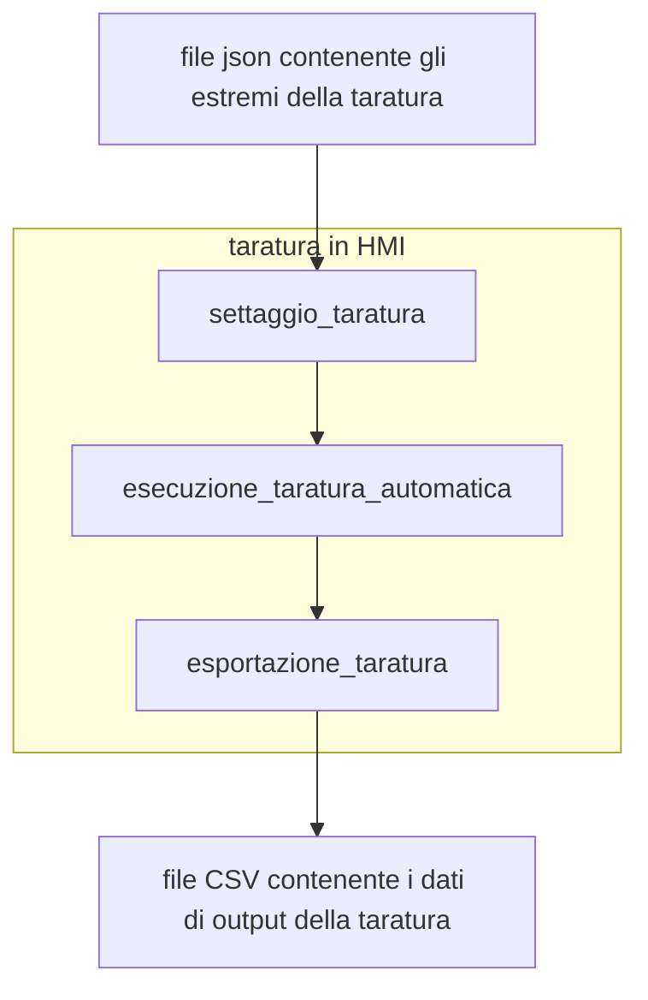

# Requirements

1. Questo sprint prevede la creazione di una procedura di taratura che permetta di "misurare" automaticamente ed esportare in un file i valori delle coppie di tutti gli assi con esoscheletro fermo in un set di posizioni definite tramite un file di settaggio.

2. I dati da contenere nel file json di settaggio sono i seguenti da ripetersi per ogni asse:

| Dato  | unità di misura | Campo di validità              | Default       |
| ----- | --------------- | ------------------------------ | ------------- |
| start | gradi           | contenuti nei limiti dell'asse | min dell'asse |
| stop  | gradi           | contenuti nei limiti dell'asse | max dell'asse |
| step  | gradi           | positivo maggiore di zero      | 1             |

3. La tabella in uscita deve avere la seguente struttura ( i dati sono puramente di esempio)

| Pos asse1 | Pos asse 2 | Pos asse N | Coppia asse1 | Coppia asse2 | Coppia asseN |
| --------- | ---------- | ---------- | ------------ | ------------ | ------------ |
| 90°       | 50°        | 70°        | 500          | -250         | 1000         |
| 90°       | 50°        | 71°        | 510          | -250         | 1000         |
| 90°       | 50°        | 72°        | 520          | -280         | 1050         |

4. Bisogna poter andare sia in direzione positiva (0-90) che negativa (90-0) .
5. Per far sì che un asse non si muova lo start e lo stop devono coincidere.
